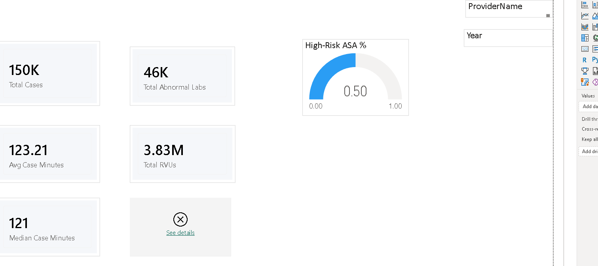
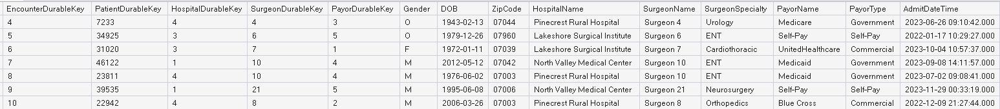
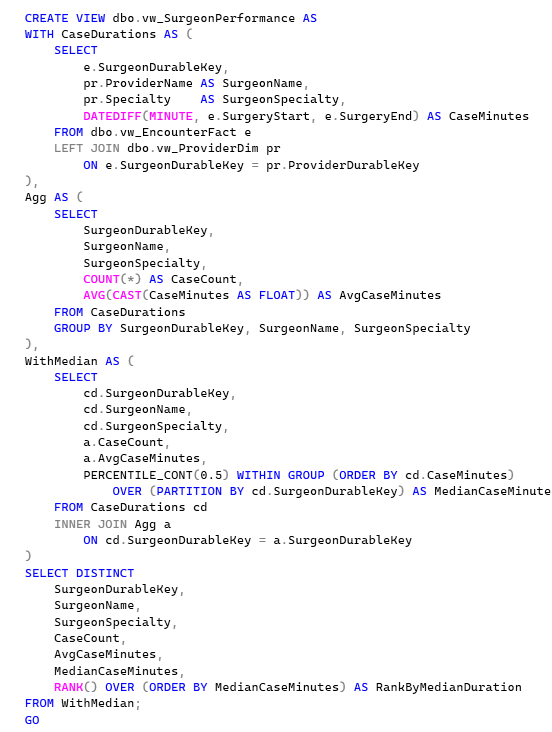
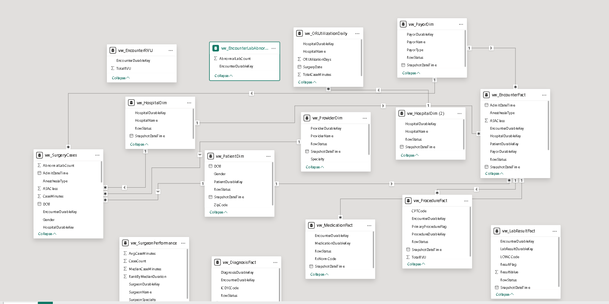
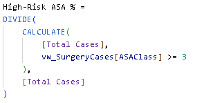

# Perioperative_Analytics_Dashboard_from_Mock_Epic_SQL_Database
Mock perioperative surgery data is wrangled into SQL Views and then source into a Power BI dashboard to provide classic perioperative data analytics.

# 🏥 Perioperative Analytics Dashboard  
### Power BI • SQL • DAX • Healthcare Data Modeling

> *Final dashboard screenshot will be added tomorrow.*

---

# 📘 Background

This project simulates a real-world **perioperative analytics workflow**, modeled after the structure and logic of an enterprise healthcare data warehouse.  
The goal is to demonstrate:

- Healthcare domain knowledge  
- SQL-based view creation  
- Power BI semantic modeling  
- DAX metric development  
- Executive-ready dashboard design  

This project uses **Caboodle-like data structures** — meaning durable keys, fact/dimension separation, snapshot logic, and clinically meaningful grain definitions.

---

# 🗂️ Data Source  
### *Epic Caboodle–Style Data Structures*

The synthetic dataset is designed to resemble the structure of a modern healthcare enterprise data warehouse.  
It includes:

- Durable keys  
- Fact tables (encounters, procedures, labs, medications)  
- Dimension tables (patient, provider, hospital, payor)  
- Surgery case–level detail  
- RVU and abnormal lab counts  
- OR utilization metrics  

**Sample Data Extract:**  

---

# 🏗️ Semantic Model  
### *Creation of SQL Views*

The semantic layer is built using SQL views that transform raw encounter-level data into analytic-ready structures.

**Example View: Surgeon Performance**  

Views include:

- `vw_SurgeonPerformance`  
- `vw_SurgeryCases`  
- `vw_EncounterFact`  
- `vw_EncounterLabAbnormals`  
- `vw_ORUtilizationDaily`  
- `vw_EncounterRVU`  

---

# 🧩 Data Modeling (Power BI)

The Power BI model follows a **clean star schema**, with fact tables at the center and dimensions radiating outward.

**Semantic Model Diagram:**  

---

# 📊 Data Metrics (DAX)

All metrics are built using clean, reusable DAX patterns.

**Example Metric: High-Risk ASA %**  

---

# 📈 Dashboard Product  
### *(TEMPORARY — Final Screenshot Coming Tomorrow)*

This section will showcase the final Power BI dashboard once completed.

**Current Placeholder:**  

---

# 📁 Repository Structure

